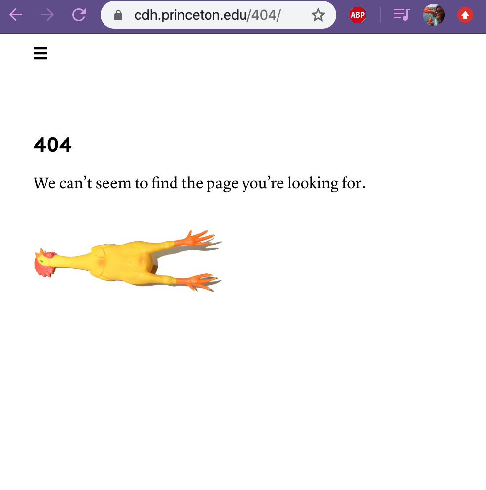

## Introduction to APIs and HTTP

So far we've focused on getting data from the web through scraping HTML pages. While in the first example we downloaded a webpage, usually we'll use a library like `requests` to make a call to a web page and then scrape it's content.

Remember in our earlier script we had the following lines of code:

```python
result = requests.get("https://dhhumanist.org/")

print(result.status_code)
print(result.headers)
```
The output was the following:
```sh
200
{'Server': 'ATS', 'Date': 'Wed, 11 Mar 2020 16:04:05 GMT', 'Content-Type': 'text/html; charset=utf-8', 'Content-Length': '5743', 'X-Frame-Options': 'SAMEORIGIN', 'Age': '0', 'Connection': 'keep-alive'}
```

*So what is this information exactly?* 

Well the first line is the **status code** of our request and the second line is the **headers** that are returned with the request. This information is important because this is how we might know if we get an error when we try to request a web page. However, to understand what this means we need a quick introduction into how the web and HTTP works.

---
### What is the Web?

[**From Wikipedia:**](https://en.wikipedia.org/wiki/World_Wide_Web)
"The World Wide Web (WWW), commonly known as the Web, is an information system where documents and other web resources are identified by Uniform Resource Locators (URLs, such as https://www.example.com/), which may be interlinked by hypertext, and are accessible over the Internet.[1][2] The resources of the WWW are transferred via the Hypertext Transfer Protocol (HTTP) and may be accessed by users by a software application called a web browser and are published by a software application called a web server."


*What does this mean exactly?*

When we type a url for a webpage (say google.com), we're actually sending an **HTTP request** to a **server** that hosts the actual HTML files and data. If the server decides that our request is ok (200), then it will give us access to the webpage.



If you've ever seen an error message when you go to a webpage saying the page doesn't exist, that means that you received a 404 error, which is a type of status code you get back from an HTTP request.

## What is HTTP?

**Courtesy of [Julia Evans' Zine](https://jvns.ca/blog/2019/09/12/new-zine-on-http/)**


This comic explains a bit more in depth what is comprised of an HTTP request. We also want to have a sense of what types of status codes we can get back from a request.


Finally, in our example we used the `GET` method when calling a webpage (using `request.get()`), but there's multiple methods that we can use to send data across the web.


[More information about HTTP from Mozilla Docs](https://developer.mozilla.org/en-US/docs/Web/HTTP/Overview)

If you're interested in the longer history of the internet checkout this timeline from the Computer History Museum, covering the history from the 1960s to the 1990s [https://www.computerhistory.org/internethistory/](https://www.computerhistory.org/internethistory/).

For more information about `requests` library, follow this tutorial [https://realpython.com/python-requests/](https://realpython.com/python-requests/) to get a bit more experience. 

If you want more experience doing web scraping, try out this tutorial ["How To Scrape Web Pages with Beautiful Soup and Python 3" by Lisa Tagliaferri](https://www.digitalocean.com/community/tutorials/how-to-scrape-web-pages-with-beautiful-soup-and-python-3). You can skip the instructions for setting up the virtual environment (remember to activate yours and use it to run Python) and start at the section on `Collecting and Parsing a Web Page`.

---
## What is an API?

So far we've gotten data through scraping web pages. To understand how web scraping works, we've learned a bit more about how the web and html pages works. Another reason to understand how the web works is because this also informs **Application Programming Interfaces** (APIs).

Just as a webpage contains data formatted in HTML, an API gives us access to data contained in a database. We commonly use APIs if we either are dealing with very large or proprietary databases. One of the ones we'll be exploring is the Library of Congress' *Chronicling America API* [https://chroniclingamerica.loc.gov/about/api/](https://chroniclingamerica.loc.gov/about/api/).

Before we jump in though, we need to cover our final piece of Python ecosystem - Jupyter notebooks and Pandas.

[**Click here to go to the next section.**](intro_pandas.md)

---
## Let's Try Out An API

jupyter notebooks and pandas

htrc feature reader

back to APIs -> feature reader going to hathi trust and asking for json but we could also just scrape that data

APIs have a greater barrier

going to look at two APIs

Library of Congress Chroncling America an

New York Times Headlines 


