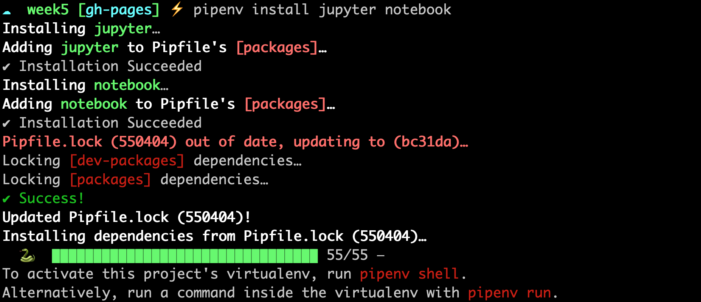

## Introduction to Pandas and Jupyter Notebook

So far when we've been writing Python code, we've either been using the Python interpreter in the terminal or saving a Python script. However, there's a third way to write Python code that's very popular in Digital Humanities - that is [Jupyter notebooks](https://jupyter.org/index.html).

To be able to use Jupyter, we first need to install it as a Python library.

In your terminal *and* in the folder with your virtual environment, type the following:

```sh
pipenv install jupyter notebook
```

*If you're not using `pipenv`, then feel free to install the library with whatever virtual environment and package manager you prefer to use.*



If you've installed successfully, you should see the following message in your terminal.

Now we can open up the Jupyter notebook in our browser with the following command.

```sh
pipenv run jupyter notebook
```

This command immediately opens the Jupyter interface in our browser. Go 
