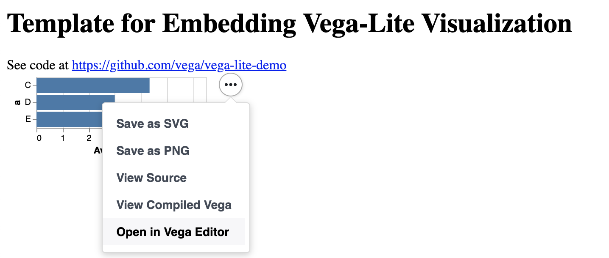

# Guide to Publishing Humanities Data Analysis

Now that you're undertaking humanities data analysis a natural question is how to present and make your analyses accessible and publicly available. This is a BIG question with many answers depending on your tools, audiences, and timelines. However, for the sake of your final projects, I wanted to cover some of the options you might pursue to present your work.

First though let's refresh on how the web works.

---

## What is the Web? [From week 6](../week6/intro_api_https.md)

[**From Wikipedia:**](https://en.wikipedia.org/wiki/World_Wide_Web)
"The World Wide Web (WWW), commonly known as the Web, is an information system where documents and other web resources are identified by Uniform Resource Locators (URLs, such as https://www.example.com/), which may be interlinked by hypertext, and are accessible over the Internet.[1][2] The resources of the WWW are transferred via the Hypertext Transfer Protocol (HTTP) and may be accessed by users by a software application called a web browser and are published by a software application called a web server."


*What does this mean exactly?*

When we type a url for a webpage (say google.com), we're actually sending an **HTTP request** to a **server** that hosts the actual HTML files and data. If the server decides that our request is ok (200), then it will give us access to the webpage.


If you've ever seen an error message when you go to a webpage saying the page doesn't exist, that means that you received a 404 error, which is a type of status code you get back from an HTTP request.

*So what does this mean for publishing on the web?*

To publish humanities data analysis requires having your files **hosted** on a server that are accessible by **url** - essentially you need a website.

Most DH projects are hosted from Github, which is a service that allows you to host files and keep versions of those files (this is what I use for the course website.) 

If you decide you want to setup your own website, I would recommend following this tutorial on creating [Github websites](https://pages.github.com/) and this book on using [git for DH projects](https://shane-et-al.github.io/git_slab/#git-and-github).

---
## Publishing Jupyter Notebooks

One of the easiest ways to publish your data analysis is to simply publish a Jupyter notebook. There's a few ways you can go about publishing these depending on whether you want to embed the notebook in a website or simply have an accessible link.

1. The simplest option is to upload your Jupyter notebook to **Google Colab** [https://colab.research.google.com/notebooks/intro.ipynb#recent=true](https://colab.research.google.com/notebooks/intro.ipynb#recent=true) and [https://colab.research.google.com/notebooks/welcome.ipynb](https://colab.research.google.com/notebooks/welcome.ipynb). You can run your entire notebook in the Google Colab environment and even do your analysis there instead of running it locally.
2. You can also use **Binder** [https://mybinder.org/](https://mybinder.org/) and [https://mybinder.readthedocs.io/en/latest/introduction.html](https://mybinder.readthedocs.io/en/latest/introduction.html) to host notebooks that you have in a Github repository.
3. Lastly, you can convert a Jupyter notebook to HTML [https://reproducible-science-curriculum.github.io/publication-RR-Jupyter/02-exporting_the_notebook/index.html](https://reproducible-science-curriculum.github.io/publication-RR-Jupyter/02-exporting_the_notebook/index.html) either in the terminal or through the web interface. You'll still need to host your html page, but this can be useful if you have a website and want to have the notebook as a page on the site.

One concern with using Altair and Jupyter notebooks is that it tends to make the file very large since it loads the data into the notebook. The size of file can be a problem for Github, so if you are ending with very large files, check out these instructions from Altair's documentation [https://altair-viz.github.io/user_guide/faq.html#why-does-altair-lead-to-such-extremely-large-notebooks](https://altair-viz.github.io/user_guide/faq.html#why-does-altair-lead-to-such-extremely-large-notebooks)

---
## Publishing Altair Charts

While publishing Jupyter notebooks might be an easier solution, often times you'll want a different reading experience than the cell format of a notebook. In that case, you can save your Altair charts and embed them on your website.

For general guidelines on saving Altair charts, check out the documentation here [https://altair-viz.github.io/user_guide/saving_charts.html](https://altair-viz.github.io/user_guide/faq.html#why-does-altair-lead-to-such-extremely-large-notebooks)

1. You can save your Altair chart directly to html with the `chart.save('chart.html')` syntax. You'll still need to host this html page on a website, but now you only have the chart rather than the entire notebook.
2. The other option is to download the compiled JSON of the chart and embed it using JavaScript.

You have the option to download the compiled json from your chart by clicking the `Open in Vega Editor`.



This will open a new window with the full Vega schema. You can select the export option, which will allow you to download the JSON (you can select either compiled or vega-lite).


The next step is to import this compiled json into your webpage.

```html
<!DOCTYPE html>
<html>
  <head>
    <title>Embedding Vega-Lite</title>
    <script src="https://cdn.jsdelivr.net/npm/vega@5.10.1"></script>
    <script src="https://cdn.jsdelivr.net/npm/vega-lite@4.10.4"></script>
    <script src="https://cdn.jsdelivr.net/npm/vega-embed@6.5.2"></script>
  </head>
  <body>
    <div id="vis"></div>

    <script type="text/javascript">
      var yourVlSpec = {
        $schema: 'https://vega.github.io/schema/vega-lite/v2.0.json',
        description: 'A simple bar chart with embedded data.',
        data: {
          values: [
            {a: 'A', b: 28},
            {a: 'B', b: 55},
            {a: 'C', b: 43},
            {a: 'D', b: 91},
            {a: 'E', b: 81},
            {a: 'F', b: 53},
            {a: 'G', b: 19},
            {a: 'H', b: 87},
            {a: 'I', b: 52}
          ]
        },
        mark: 'bar',
        encoding: {
          x: {field: 'a', type: 'ordinal'},
          y: {field: 'b', type: 'quantitative'}
        }
      };
      vegaEmbed('#vis', yourVlSpec);
    </script>
  </body>
</html>
```
In this example from the Vega docs, `yourV1spec` is our compiled chart.

So for our purposes we would have the following:

```html
<!DOCTYPE html>
<html>
  <head>
    <title>Embedding Vega-Lite</title>
    <script src="https://cdn.jsdelivr.net/npm/vega@5.10.1"></script>
    <script src="https://cdn.jsdelivr.net/npm/vega-lite@4.10.4"></script>
    <script src="https://cdn.jsdelivr.net/npm/vega-embed@6.5.2"></script>
  </head>
  <body>
    <div id="vis"></div>

    <script type="text/javascript">
      var yourVlSpec = "/visualization.vl.json";
      vegaEmbed('#vis', yourVlSpec);
    </script>
  </body>
</html>
```

Obviously we haven't covered much about HTML and haven't discussed at all JavaScript, but you might recognize some of the syntax inherently.

Our `script` tags at the beginning of our webpage are importing the required libraries (just like our `import` statements).

In our last `script` tag, we're writing our code. First we are assigning a variable called `yourVlSpec` and passing it a string that contains the path to our compiled chart. Then we pass that variable to the class of `vegaEmbed`.

```html
// More argument info at https://github.com/vega/vega-embed
vegaEmbed('#vis', yourVlSpec);
```
This class takes two arguments. The first is where we want the chart displayed (in this case a `div` with the `id` of `vis`). Then the second argument is the variable with the compiled chart.

The benefit of this approach let's you include other materials on your webpage, like additional text and images, as well as allowing different layouts.

However, using this approach also requires quite a bit of additional work so you may want to start with publishing your notebooks before you start building an actual website.