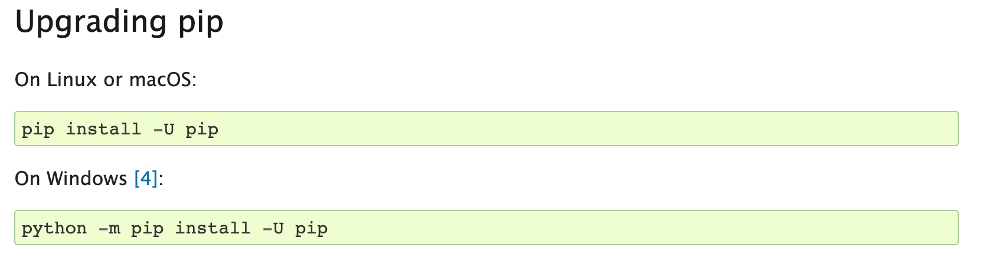

#### Virtual Environment
*If you already have experience with virtual environments and have a preferred setup, feel free to keep using what you have*

#### What is virtual environment?

This past week we started exploring Python libraries that ship with Python when you install it on your computer, but that still need to be imported so that we can use it (remember Pathlib!). Now we're going to start installing additional libraries that don't ship with Python. However, before we install these libraries, we need to create a virtual environment. A virtual environment is necessary to keep the libraries we install contained to each project.

The Python documentation explains that "Python applications will often use packages and modules that don’t come as part of the standard library. Applications will sometimes need a specific version of a library, because the application may require that a particular bug has been fixed or the application may be written using an obsolete version of the library’s interface.

This means it may not be possible for one Python installation to meet the requirements of every application. If application A needs version 1.0 of a particular module but application B needs version 2.0, then the requirements are in conflict and installing either version 1.0 or 2.0 will leave one application unable to run.

The solution for this problem is to create a virtual environment, a self-contained directory tree that contains a Python installation for a particular version of Python, plus a number of additional packages." You can read more here about [virtual environments](https://docs.python.org/3/tutorial/venv.html).

Prior to installing our virtual environment, let's make sure that you have the latest version of `pip`, which stands for "Python Installs Packages." Pip comes built-in to Python, but run this code to ensure you have the right version.



1. Check if you have pip installed [https://stackoverflow.com/questions/40868345/checking-whether-the-pip-is-installed](https://stackoverflow.com/questions/40868345/checking-whether-the-pip-is-installed)

2. Install Pipenv (follow instructions) [https://docs.python-guide.org/dev/virtualenvs/#installing-pipenv](https://docs.python-guide.org/dev/virtualenvs/#installing-pipenv)

*If you get an error message, Slack message the instructor*

---
#### Setting up a virtual environment and try installing a package

[https://pipenv-fork.readthedocs.io/en/latest/basics.html](https://pipenv-fork.readthedocs.io/en/latest/basics.html)
```sh
pipenv shell
```
```sh
pipenv install <package>
```