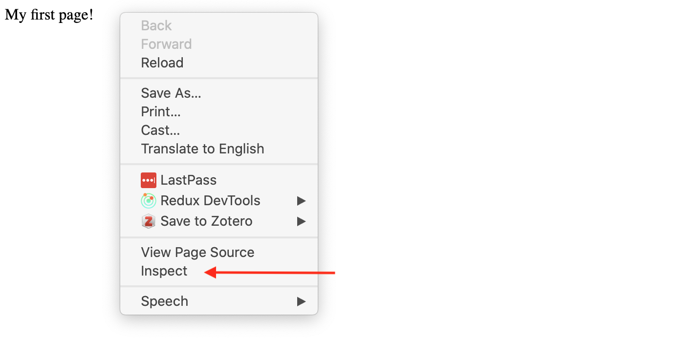

## Introduction to HTML and Web Scraping


#### What's HTML?

"HTML (Hypertext Markup Language) is not a programming language; it is a markup language used to tell your browser how to structure the web pages you visit. It can be as complicated or as simple as the web developer wishes it to be. HTML consists of a series of elements, which you use to enclose, wrap, or mark up different parts of the content to make it appear or act a certain way. The enclosing tags can make a bit of content into a hyperlink to link to another page on the web, italicize words, and so on."

*Wondering what a Markup Language is?*

From [handy Wikipedia](https://en.wikipedia.org/wiki/Markup_language), "a markup language is a system for annotating a document in a way that is syntactically distinguishable from the text, meaning when the document is processed for display, the markup language is not shown, and is only used to format the text."


So for example the popular digital humanities project, TEI (Text Encoding Initiative) is an example of a markup language.

Read through this [introduction from Mozilla on HTML](https://developer.mozilla.org/en-US/docs/Learn/HTML/Introduction_to_HTML/Getting_started#What_is_HTML), if you have any questions or get stuck feel free to Slack the instructor.

---

*So what is HTML?*

HTML consists of a series of **tags**. Tags have a name, a series of key/value pairs called **attributes**, and some textual content. Attributes are optional. 

Let's try writing an html file. Create a file in your workspace called `first_page.html` (remember to use `touch`). Open the file in your editor (VSCode or whatever you're using) and add the following code:

```html
<p>My first page!</p>
```
Save it and open the file in your Browser (probably Chrome), what do you see? What happened to our element's tags? Let's right click on our page and select `inspect`.



What we're using is called the Chrome DevTools Console ([you can find more info here](https://developers.google.com/web/tools/chrome-devtools/console/) and instructions for [Firefox here](https://developer.mozilla.org/en-US/docs/Tools/Page_Inspector/How_to/Open_the_Inspector)). What we're seeing is called the **source code**.

So here's a simple example, using the HTML <p> tag (p means "paragraph"). This example has just one tag in it: a <p> tag. The source code for a tag has two parts, its opening tag (<p>) and its closing tag (</p>). In between the opening and closing tag, you see the tag's contents (in this case, the text says "My first page!").

Let's take a look at some of the more common HTML tags that we can use to create HTML elements [https://www.w3schools.com/tags/ref_byfunc.asp](https://www.w3schools.com/tags/ref_byfunc.asp) 

How would we make it into an HTML heading?

```html
<h1>My first page!</h1>
```

Remember HTML elements can also have [attributes](https://developer.mozilla.org/en-US/docs/Learn/HTML/Introduction_to_HTML/Getting_started#Attributes). Let's try using the `anchor` tag and `href` attribute to create an HTML element that links to `https://cdh.princeton.edu/`

You can find a list of HTML attributes here [https://www.w3schools.com/tags/ref_attributes.asp](https://www.w3schools.com/tags/ref_attributes.asp)

```html
<h1><a href="https://cdh.princeton.edu/">My first page!</a></h1>
```
How does this new tag change our html page? 

Here's another example that we should add to our html page, using the HTML <div> tag:

```html
<div class="header" style="background: blue;">Digital Humanities Tools and Projects</div>
```

In this example, the tag's name is div. The tag has two attributes: class, with value `header`, and style, with value `background: blue;`. The contents of this tag is Digital Humanities Tools and Projects.

Tags can contain other tags, in a hierarchical relationship. For example, here's some HTML to make a bulleted list:

<ul>
  <li>Python</li>
  <li>Princeton Prosody Archive</li>
  <li>Gephi</li>
</ul>

The <ul> tag (ul stands for **unordered list**) in this example has three other <li> tags inside of it (li stands for **list item**). The <ul> tag is said to be the **parent** of the <li> tags, and the <li> tags are the **children** of the <ul> tag. All tags grouped under a particular parent tag are called **siblings.**

*HTML's shortcomings*

HTML documents are intended to add **markup** to text to add information that allows browsers to display the text in different ways---e.g., HTML markup might tell the browser to make the font of the text a particular size, or to position it in a particular place on the screen.

Because the primary purpose of HTML is to change the appearance of text, HTML markup usually does not tell us anything useful about what the text means, or what kind of data it contains. When you look at a web page in the browser, it might appear to contain a list of newspaper articles, or a table with birth rates, or a series of names with associated biographies, or whatever. But that's information that we get, as humans, from reading the page. There's (usually) no easy way to extract this information with a computer program.

HTML is also notoriously messy---web browsers are very forgiving of syntax errors and other irregularities in HTML (like mismatched or unclosed tags). For this reason, we need special libraries to parse HTML into data structures that our Python programs can use, libraries that can make a "good guess" about what the structure of an HTML document is, even when that structure is written incorrectly or inconsistently.

---

### Introduction to Web Scraping in Python

Let's install our 

Complete Jeri Wieringa, "Intro to Beautiful Soup," The Programming Historian 1 (2012), [https://programminghistorian.org/en/lessons/intro-to-beautiful-soup](https://programminghistorian.org/en/lessons/intro-to-beautiful-soup). If you have questions or get stuck, please Slack the instructor.


