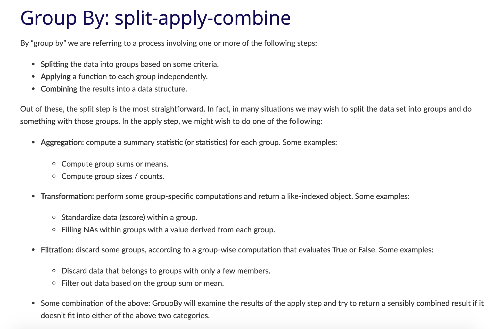
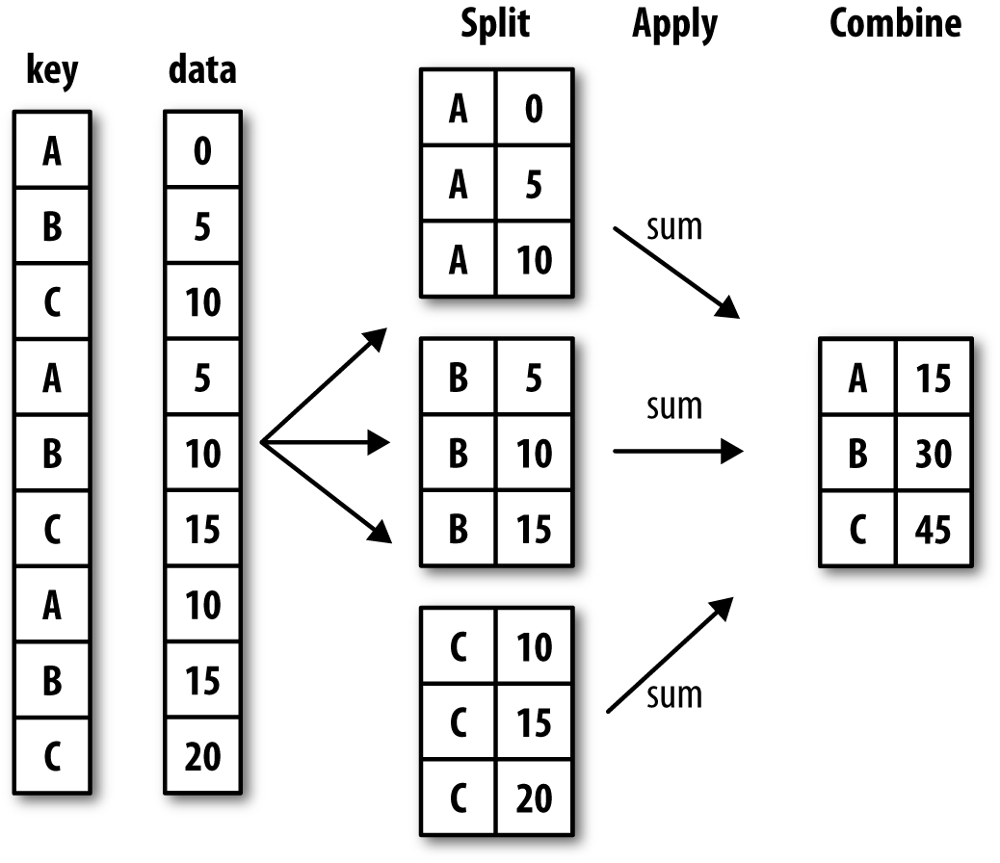
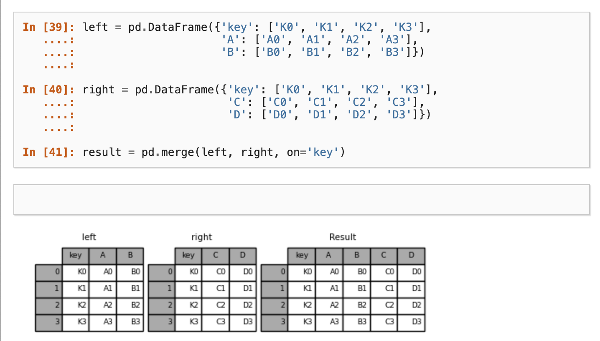

# Advanced Pandas Resources

---
Pandas built in calculation methods [https://pandas.pydata.org/pandas-docs/stable/user_guide/computation.html#id1](https://pandas.pydata.org/pandas-docs/stable/user_guide/computation.html#id1)
| Pandas method	| Explanation |
|:----------:|:----------:|
|`.count()`| Number of non-NA observations|
|`.sum()`| Sum of values|
|`.mean()`|	Mean of values|
|`.median()`| Median of values|
`.min()` | Minimum value|
`.max()`| Maximum value| 
`.mode()`| Mode|
`.std()`| Sample standard deviation of values |
| `describe()` | Compute set of summary statistics for Series or each DataFrame column|

You can use these methods on both DataFrame and Series, as well as grouped DataFrame.

---
Pandas documentation for using groupby [https://pandas.pydata.org/pandas-docs/stable/user_guide/groupby.html]

---
**Pandas Merge**

Often times when we're working with datasets, we will have our data split into multiple csv files. Pandas has built in functionality that let's us merge together dataframes so that we can perform analysis on the combined dataset.

[https://pandas.pydata.org/pandas-docs/stable/user_guide/merging.html#database-style-dataframe-or-named-series-joining-merging](https://pandas.pydata.org/pandas-docs/stable/user_guide/merging.html#database-style-dataframe-or-named-series-joining-merging)

---
**Pandas Plot**

So far we've been exploring the data in tables or producing descriptive statistics, but Pandas also lets us visualize this data using basic plots.

[https://pandas.pydata.org/pandas-docs/stable/user_guide/visualization.html](https://pandas.pydata.org/pandas-docs/stable/user_guide/visualization.html)