## Introduction to Pandas and Jupyter Notebooks

So far when we've been writing Python code, we've either been using the Python interpreter in the terminal or saving a Python script. However, there's a third way to write Python code that's very popular in Digital Humanities - that is [Jupyter notebooks](https://jupyter.org/index.html).

*So what is a Jupyter notebook?*

> The Jupyter Notebook is an open-source web application that allows you to create and share documents that contain live code, equations, visualizations and narrative text. Uses include: data cleaning and transformation, numerical simulation, statistical modeling, data visualization, machine learning, and much more.

The popularity of Jupyter notebooks is that it allows you to do *exploratory data analysis* in the browser, letting you manipulate data and see the results without have to rerun an entire script.

---
To be able to use Jupyter, we first need to install it as a Python library.

In your terminal *and* in the folder with your virtual environment, type the following:

```sh
pipenv install jupyter notebook
```

*If you're not using `pipenv`, then feel free to install the library with whatever virtual environment and package manager you prefer to use.*

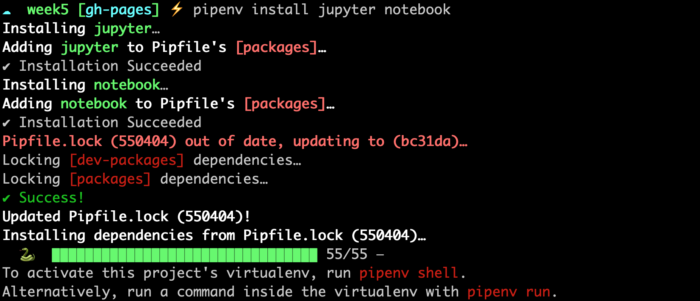

If you've installed successfully, you should see the following message in your terminal.

Now we can open up the Jupyter notebook in our browser with the following command.

```sh
pipenv run jupyter notebook
```

This command immediately opens the Jupyter interface in our browser.

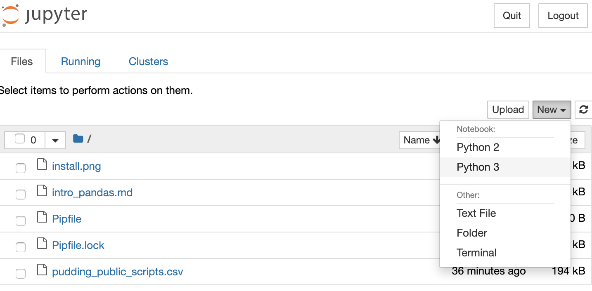

Our first step is to create a new Python 3 notebook using the `new` button.

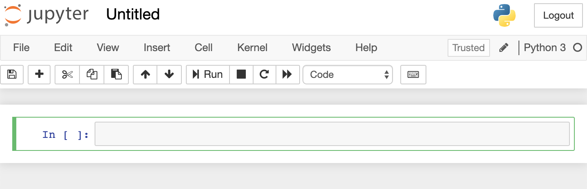

This opens up an empty notebook and we can rename the notebook by clicking on `Untitled`.

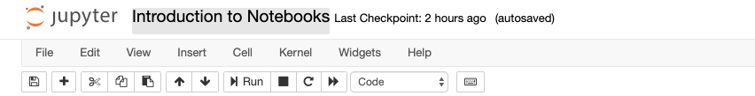

I renamed my notebook `Introduction to Notebooks`.

Now in a Jupyter notebook, we can still use much of the same Python syntax as our scripts. For example, going back to our DH Tools script, we could still use our functions to store data about various DH tools.

Try pasting the following within the first cell of the Jupyter notebook:
```python
def make_tool_dict(name, value_2015 , value_2016, value_2017,value_2018, value_2019):
    tool = {
        "2015":value_2015,
        "2016":value_2016,
        "2017":value_2017,
        "2018":value_2018,
        "2019":value_2019,
        "name":name,
        "total":value_2015+value_2016+value_2017+value_2018+value_2019
    }
    return tool
```
It should look like the following:
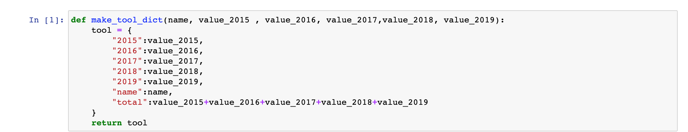
Unlike with our scripts where we would need to save our file and then type `pipenv run python script.py`, we can just click on the cell and either press `Shift` + `Return` on a Mac or  `Shift` + `Enter` on Windows to run the cell.

You'll notice that it seems like nothing happened, though now there's a `1` next to the cell. That means that it the first cell run in the notebook, if you run it again, it will show `2`. 

Unlike with scripts, notebooks hold variables in memory, which means that our function now exists in the notebook and we can call in a new cell.

Add a new cell below our function one by pressing the `+` symbol in the tool bar. Then paste the following code and run it.

```python
make_tool_dict("Python",9,22,27,32,35)
```

You should now see output from the function below our code.

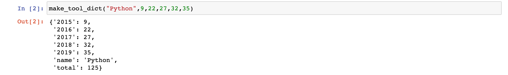

Just like in a script if we want to save this output, we need to assign it to a variable.

Paste the following in a new cell.

```python
tool1 = make_tool_dict("Python",9,22,27,32,35)
```
Now when you run that cell, you'll see no output because we've stored in a variable. To check that our function worked you can either use the built-in `print()` method or simply type the variable in the cell.

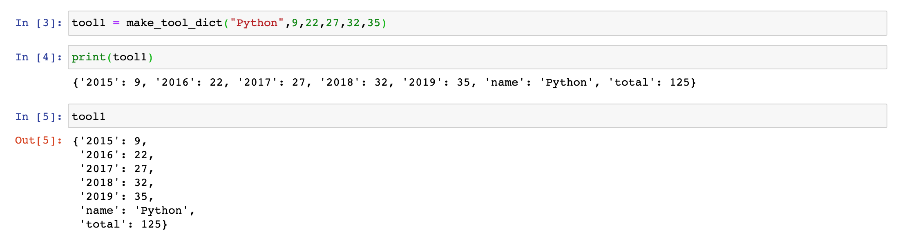

To learn more of the shortcuts for Jupyter notebooks, go to the [shortcuts file](shortcuts.md).

Jupyter notebooks will autosave your notebook, but it's good to save it before leaving the notebook (you can save pressing the file icon).

To exit the notebook, you can either press the `Quit` button on the main page or type `Ctrl`+`c` in the terminal and selecting `yes` to quitting the notebook.

If you get stuck you can check my code on our Github repository [here](Introduction%20to%20Notebooks.ipynb)

---

## Data in Jupyter Notebooks

Jupyter notebooks are particularly useful for working with tabular data (that is data in spreadsheets), especially with the Python Library Pandas.

Let's download Pandas and try it out in our Jupyter Notebook.

Type `pipenv install pandas` in the folder with you Pipfile and once it is installed, restart your notebook with `pipenv run jupyter notebook`.

First, let's create a new notebook.

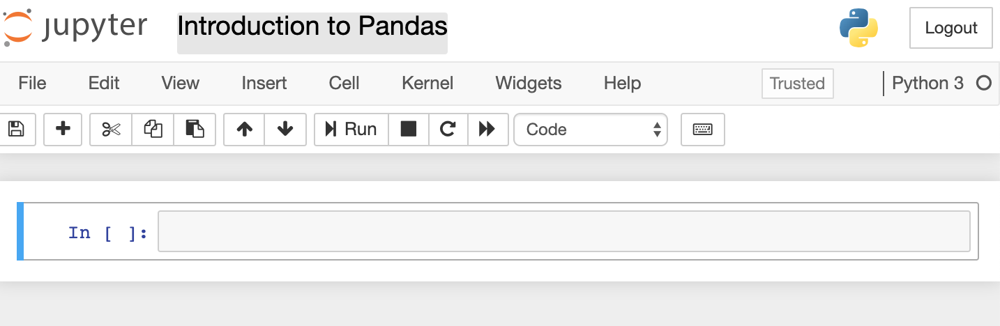

Now let's import Pandas into our notebook! Place the following code into our first cell and run it.

```python
import pandas as pd
```
We can check that this worked, by outputting the version of pandas, with the following:

```python
pd.__version__
```
Notice we used the `as` keyword. This is a built in feature of Python that lets us import libraries and give them shorter nicknames, so that we don't have to type `pandas` each time we want to use a feature of the library.

Now we're going to try reading in a spreadsheet to our notebook. We're going to be using the spreadsheet from "Film Dialogue" by *The Pudding* that is available here [https://docs.google.com/spreadsheets/d/1fbcldxxyRvHjDaaY0EeQnQzvSP7Ub8QYVM2bIs-tKH8/edit?usp=sharing](https://docs.google.com/spreadsheets/d/1fbcldxxyRvHjDaaY0EeQnQzvSP7Ub8QYVM2bIs-tKH8/edit?usp=sharing). I'll post a version of the spreadsheet in Slack so that you can easily download it. **Be sure to put the file within the folder of your Jupyter notebook.**

Once we have this file, we can read it into our notebook so that we can access the data using the built-in method from pandas called `read_csv()`.

Paste the following code into a new cell:
```python
film_scripts = pd.read_csv('pudding_public_scripts.csv')
```
Before we explore the variable `film_scripts`, we can also learn a bit more about `read_csv()`, using Pandas built-in `help()` method.

Below `film_scripts`, paste:

```python
help(pd.read_csv)
```


This function prints out the documentation for this method, which is useful in case you have questions. Alternatively, we can always use the Pandas documentation [https://pandas.pydata.org/pandas-docs/stable/reference/api/pandas.read_csv.html](https://pandas.pydata.org/pandas-docs/stable/reference/api/pandas.read_csv.html).

So now let's inspect `film_scripts`.

First, we can test what the variable contains by using `type(film_scripts)`, which tells us that it a `pandas.core.frame.DataFrame`.

Dataframes are the primary data structures in Pandas (think like dictionaries or lists) and are defined as "a 2-dimensional labeled data structure with columns of potentially different types. You can think of it like a spreadsheet or SQL table, or a dict of Series objects." You can read more about them here [https://pandas.pydata.org/pandas-docs/stable/getting_started/dsintro.html#dataframe](https://pandas.pydata.org/pandas-docs/stable/getting_started/dsintro.html#dataframe)

We can then display the data in the dataframe a few different ways.

First, we can type the variable `film_scripts` into a cell, which shows us the columns and a few rows, though much of the dataframe is truncated.

We can also type `film_scripts.head()`, which prints out the first few rows or `film_scripts.sample()` which prints out a random sample of rows.

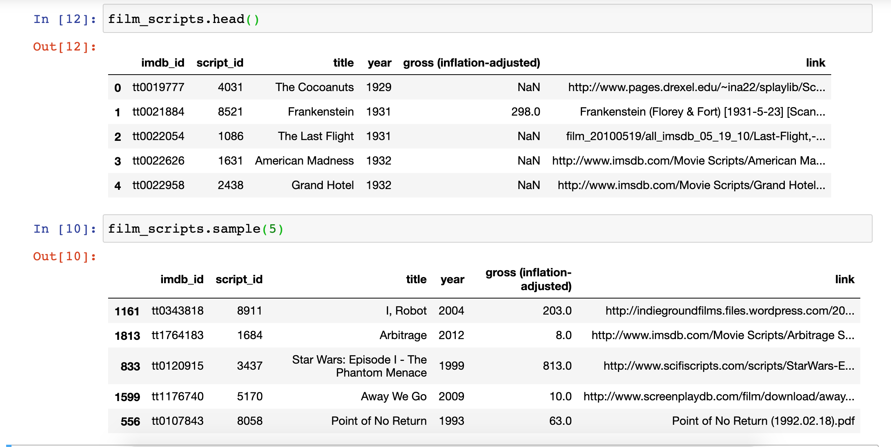

We might also want to explore the size of our dataset, as well as the types of data it contains.

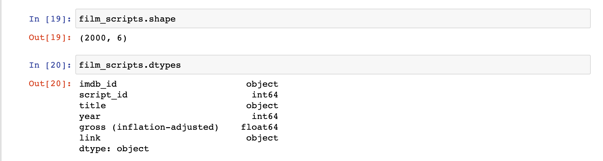

We can use the `shape` and `dtypes` attributes that are built-in on the DataFrame Class. `shape` tells us that we have 2000 rows and 6 columns, while `dtypes` tells us the data types of each of those columns.

Pandas data types build from ones available in Python. This tables compares Pandas to Python and another library called Numpy (you read more about Pandas data types from [here](https://pbpython.com/pandas_dtypes.html)).

| Pandas dtype | Python type | NumPy type | Usage|
|:----------:|:----------:|:----------:|:----------:|
|object | str or mixed | string_, unicode_, mixed types	|Text or mixed numeric and non-numeric values |
int64	| int	| int_, int8, int16, int32, int64, uint8, uint16, uint32, uint64 | 	Integer numbers |
float64	| float	| float_, float16, float32, float64	|Floating point numbers |
bool |	bool |	bool_	| True/False values |
datetime64 |	NA|	datetime64[ns]|	Date and time values
timedelta[ns]	|NA |	NA |	Differences between two datetimes |
category|	NA|	NA	|Finite list of text values|

You'll notice that some of the data types are only available in Pandas. It's important to check what data types exist in your columns, since it informs the types of data manipulation you can do with your dataset.

Let's explore the `link` column. To access a particular column in Pandas, we can use a few different syntaxes. Try typing in one cell `film_scripts['link']` and then in the following cell `fiml_scripts[['link]]`. What differences do you notice?

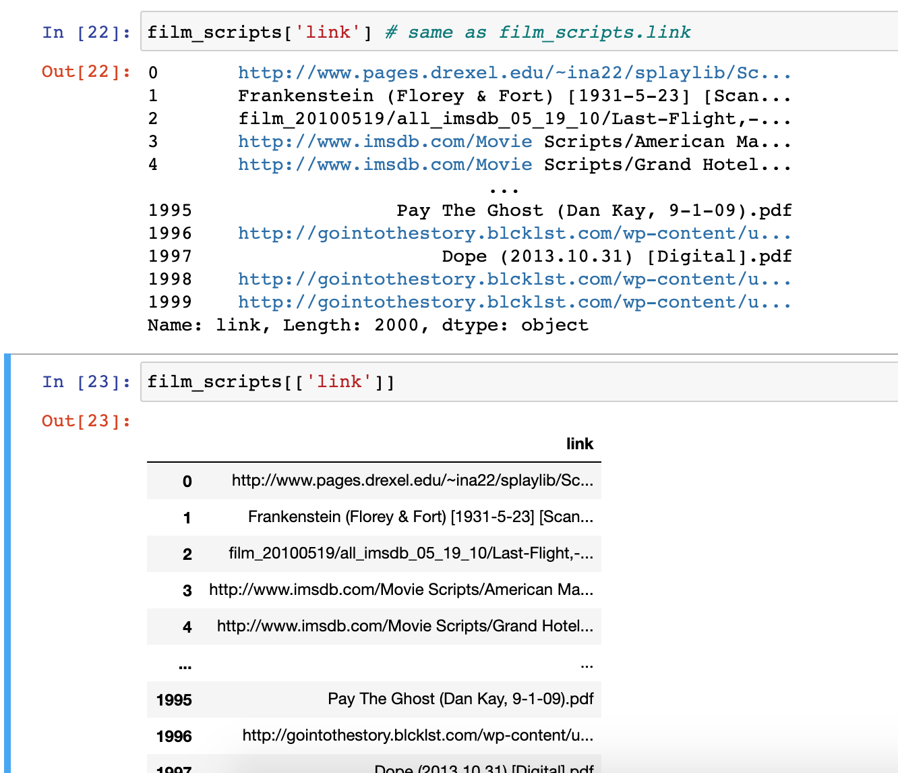

The difference in the output for each of these syntaxes has to do with how Pandas handles `indexing` (as a refresher, we index in Python using single square brackets).

In Pandas, using a single bracket is used to index either a single column or selected rows, and essentially refers to one dimension of the dataframe (rather than two). Whereas two square brackets allows us to both index for a column, but then also potentially request a list of columns.

Let's try out some examples:
- Type `film_scripts[0:5]` in a cell and run it. What results do you get?
- Type `film_scripts[['link', 'title']]` in a cell and run it. What results do you get?

For the first example, you should see the first five rows of the dataframe, while the second example should show you the data in the columns `link` and `title`.

To understand the difference between these types of indexing, we can type following:

```python
print(type(film_scripts['link']))
print(type(film_scripts[['link']]))
```
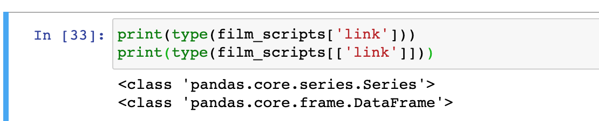

The output here tells us that the first example is returning a class type `Series`, while the second example is returning a class type `DataFrame`. While dataframes are two-dimensional data structures, in Pandas, Series are used to store one-dimensional data (like a column). You can learn more about indexing from the Pandas documentation [https://pandas.pydata.org/pandas-docs/stable/user_guide/indexing.html](https://pandas.pydata.org/pandas-docs/stable/user_guide/indexing.html).

Let's start exploring the data in the `link` column. Try typing:

```python
film_scripts['link'].tolist()
```
You should get a long list of all the values in the column as your output. Notice that while some of the items are URLs, others are PDF files that aren't hosted on the web. Someone coming to this dataset might assume that `link` represents only URLs, so how can we provide a better column name?

Let's use pandas `rename()` method to rename our column. We can read the documentation here [https://pandas.pydata.org/pandas-docs/stable/reference/api/pandas.DataFrame.rename.html](https://pandas.pydata.org/pandas-docs/stable/reference/api/pandas.DataFrame.rename.html)

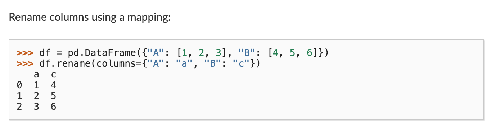

Looking at the documentation we can see that we call `rename()` after our dataframe and pass it an argument called `columns` which takes a dictionary of old column names as keys and new column names as values.

So let's try it out:
```python
film_scripts.rename(columns={'link': 'source'})
```
However one issue with this code is that if we use `film_scripts` in a new cell, it won't show this new column name. To save our result we need to use the `inplace` argument in rename.
```python
film_scripts.rename(columns={'link': 'source'}, inplace=True)
```
Now when we run this cell, film_scripts will contain the updated column name (unless we reload the data into the notebook and overwrite film_scripts).

Instead of renaming the column, we could have also copied the column into a new one that we add to the dataframe.

Try out:
```python
film_scripts['link'] = film_scripts['source']
```
Now we've recreated our `link` column, which defeats our purposes. So we can also delete a column using Pandas `drop()` functionality.

Paste:
```python
film_scripts_dropped = film_scripts.drop(['link'], axis=1) 
```
In this case, we assigned a copy of the dataframe `film_scripts` to a new variable called `film_scripts_dropped` and then also dropped the column `link`. Just like with standard Python syntax, we can assign dataframes to new variables depending on how we want to store and manipulate our data.

With Pandas we can also manipulate the dataframe organization based on the data within the rows.

For example, if we want to see the data organized by title alphabetically, we could use the `sort_values()` method.

```python
film_scripts.sort_values(by=['title'])
```

Now we can see that the first movie alphabetically was actually "(500) Days of Summer."

Try putting in `film_scripts.columns` in a cell and running it.

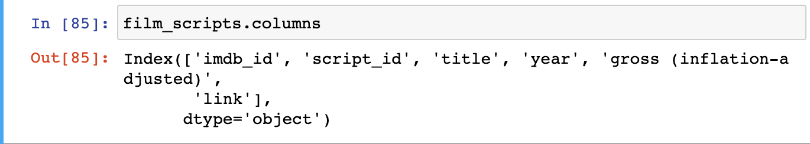

`.columns` outputs the names of all the columns in the dataframe.

Let's rename `'gross (inflation-adjusted)'` into something that's easier to type, like `gross_ia`. When we index the dataframe to select `gross_ia` as a column, what is in the data value in the first cell?

The output of `film_scripts[['gross_ia']]` should be `NaN`. This stands for "Not a Number" and is Pandas' way of telling us that there's no data in the first row for this column. 

Pandas has great documentation for dealing with missing data that you can read here [https://pandas.pydata.org/pandas-docs/stable/user_guide/missing_data.html](https://pandas.pydata.org/pandas-docs/stable/user_guide/missing_data.html).

We'll focus on using filtering to remove this missing data. One of the easiest ways we can filter is simply seeing how many of the values are equal to or above zero.

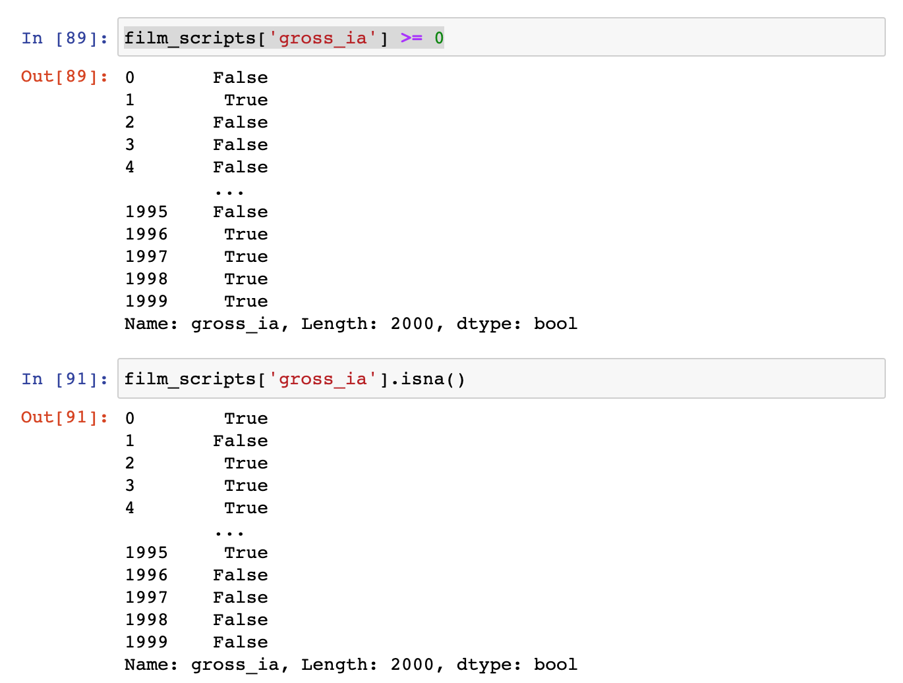

You'll notice that we can use a conditional expression with the `gross_ia` column to tell us which cells are empty (*hint* False here would indicate that the cell contains NaN). We can also use the built-in `isna()` method which will check if any of the cells are empty and return `True` if they are.

Now if we want to remove all the rows with empty values for `gross_ia`, we can simply filter the dataframe using the following code.

```python
film_scripts[film_scripts.gross_ia >= 0]
```
Now rather than two thousands rows, we have a dataframe with 1662 rows.

We can save this into a new variable:
```python
film_scripts_cleaned = film_scripts[film_scripts.gross_ia.isna() == False]
```
And now start calculating some summary values for the dataframe.

For example, we could calculate the total gross income for all the films using the `sum()` method. 
```python
film_scripts_cleaned.gross_ia.sum()
```
This gives us the value of `172749.0`, which might be interesting but is likely too much aggregation of our data to be useful.

One question we might have is how much gross happened per year in this dataset? How would we start answering this question?

One thing we do is try and find out how many movies are recorded for each year, using the `value_counts` method. This method counts the unique values in each column [https://pandas.pydata.org/pandas-docs/stable/reference/api/pandas.Series.value_counts.html](https://pandas.pydata.org/pandas-docs/stable/reference/api/pandas.Series.value_counts.html) 

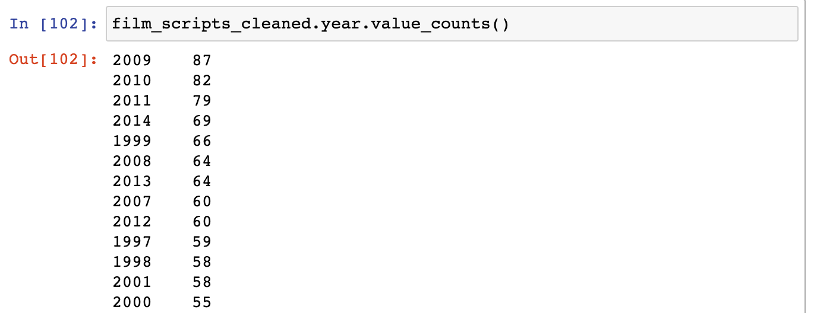

This shows us that years with the top amount of grossing films were fairly recent, with 2009 having 87 films. However, this doesn't really tell us how much total gross exists for each year.

To calculate that we need to group together the rows by their years and then add together the values in `gross_ia`.

We can do perform this operation using an advanced Pandas method called `groupby()`, which you can read more about here [https://pandas.pydata.org/pandas-docs/stable/user_guide/groupby.html](https://pandas.pydata.org/pandas-docs/stable/user_guide/groupby.html).

Groupby is popular because it lets you select groups of data and then perform calculations on those smaller groups.

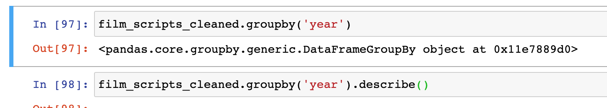

In this example, you'll notice that we call `groupby` on the dataframe and then pass it an argument, in this case the column name `year`. The column we pass is the one we want to use to *aggregate* our data. We could also pass in `title`, but would likely only get groups with one row each.

The output of our `groupby()` is a new class called `DataFrameGroupBy`, which is different than a normal DataFrame. Let's save this to a new variable called `films_year`, and then try to see what data exists in our group for 2008.

```python
films_year = film_scripts_cleaned.groupby('year')
films_year.get_group(2009)
```
Running the code should return only the rows that contain the year 2009 in our dataset. Unlike a normal DataFrame, to see the values in a DataFrameGroupBy we need to use the `get_group()` method, passing it a value from the column we used to aggregate the data.

Or we can perform a calculation on the groupby and turn it back into a normal dataframe.

Try running this code:
```python
films_year = film_scripts_cleaned.groupby('year')['gross_ia'].sum().reset_index()
```
Now in a new cell try checking the `type()` of `films_year` and `print()` the value of this variable.

You should see that we now have a DataFrame that contains the total gross for each year. We'll go over `groupby()` later in class, but feel free to bring questions or code snippets you've tried.

In case you get stuck, you can see all this code in my Jupyter Notebook on our Github site [here](Introduction%20to%20Pandas.ipynb).