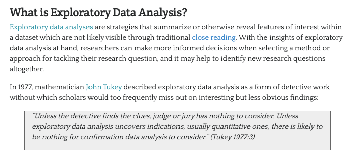

# Cleaning and Preparing (Text) Data for Analyses

Before undertaking any type of data analysis ( whether humanities or exploratory), we need to both understand our data (think producing a data biography) and often *clean* it.

*So what does it mean to clean data?*

The term cleaning data refers to a whole set of transformations that you may or may not decide to undertake. So why would someone clean data? Remember in the "Data Biographies" article by Heather Krause, she discussed subsetting the data to just the data from Rwanda since it was the most consistent across the time period and in its collection - this is a type of data cleaning, in this case selecting a subset of data. Krause made this selection because otherwise there was too much variability in the *data quality* to perform their analyses.

Cleaning data can also mean normalizing distributions, removing null values, and even transforming some of the data to standardize it. But regardless of what you choose to do, the reason to undertake this step is because of the concept of **GIGO**.


GIGO stands for "Garbage In, Garbage Out" (to read more about the origins of GIGO, read this article [https://www.atlasobscura.com/articles/is-this-the-first-time-anyone-printed-garbage-in-garbage-out](https://www.atlasobscura.com/articles/is-this-the-first-time-anyone-printed-garbage-in-garbage-out)). GIGO is important because it essentially means that the quality of your data analysis is always dependent on the quality of your data.

One thing to remember with datasets is that the act of collecting data is in of itself an interpretation. And so cleaning data adds another layer of interpretation (sometimes many layers) to the dataset, which is why its crucial to keep a record of how you transform your data.

However, it is also important to realize that even with cleaning you will never have a *perfect* dataset. In humanities data analysis, data cleaning is somewhat controversial because it means distorting the original source material (you can read more about this controversy in [Katie Rawson and Trevor Muñoz, “Against Cleaning”, *Debates in DH* 2019](https://dhdebates.gc.cuny.edu/read/untitled-f2acf72c-a469-49d8-be35-67f9ac1e3a60/section/07154de9-4903-428e-9c61-7a92a6f22e51)). So one of the considerations for any humanities data analysis is not only *how* to data clean, but *why* and to *what* degree.

---
### Exploratory Data Analysis with Pandas and Python

The first step in data cleaning is to not actual clean the data, but instead perform initial exploratory data analysis (EDA). We briefly discussed EDA in class, but here's the image briefly defining the term from the class slides.

|| 
|:--:|
| *From Zoë Wilkinson Saldaña "Sentiment Analysis for Exploratory Data Analysis" [https://programminghistorian.org/en/lessons/sentiment-analysis](https://programminghistorian.org/en/lessons/sentiment-analysis)* |

In his 1977 book *Exploratory Data Analysis*, Tukey argued that EDA could help suggest hypotheses that could be then tested statistically.

With Pandas we can perform all of the necessary steps for EDA.

1. We want to explore the data, so we could use `head()`, `tail()`, or `sample()` methods to display a subset of the dataset.

2. Next we might use the `describe()` method to output a summary of our dataset. According to the documentation for this method, it provides "descriptive statistics include those that summarize the central tendency, dispersion and shape of a dataset’s distribution, excluding NaN values." [(Read the docs here)](https://pandas.pydata.org/pandas-docs/stable/reference/api/pandas.DataFrame.describe.html).

3. After getting this bird's eye view of the distribution of the data, we could use `sort_values()` or `nsmallest()` / `nlargest()` to either organize the dataset or return the rows with maximum or minimum of values in a certain column.

4. We can use the `isna()` to see what values might be missing in the dataset. Remember that `isna()` can be run on either individual columns or the entire dataframe, and that you can chain it with other methods `any()` to check if there are *any* null values in the data. 

5. Finally we would use the `plot()` method to do some initial graphing of the trends in our data to fully help explore its distribution and potential correlations.

---
### Cleaning (Text) Data with Pandas and Python

Once we've explore our data, we can start assessing how we might *clean* the data. 

**THIS IS AN ITERATIVE PROCESS!**

While you might start cleaning your data before undertaking any analyses, it is likely that you will need to re-transform your data many times depending on your methods.

One best practice is to save multiple versions of your dataset as csv files, so that you don't either overwrite your original data or have to rerun previous transformations.

Remember that with Pandas we can read and write csv files using `pd.read_csv()` and `{name of your dataframe}.to_csv()`.

Remember in our movies example we selected a subset of the data using Pandas.

```python
film_scripts[film_scripts.gross_ia >= 0]
film_scripts_cleaned = film_scripts[film_scripts.gross_ia.isna() == False]
```
You will often want to either drop nulls or select a subset of your data, and you can use the bracket notation in Pandas to select all rows that meet a particular condition.

We also used `groupby` to transform our data into new aggregate versions *or* apply transformations across the data.

```python
films_year = film_scripts_cleaned.groupby('year')
films_year.get_group(2009)
humanist_vols['humanities_computing_counts'] = humanist_vols.text.apply(lambda x: x.count('humanities computing'))
```

When exploring your data you might often find duplicates. You can use the `drop_duplicates()` method on either the entire dataframe or use the `subset=[]` argument to pass in specific columns. You can also specify which of the duplicates you want to keep (options are the first or last). More information is available in [the docs](https://pandas.pydata.org/pandas-docs/stable/reference/api/pandas.DataFrame.drop_duplicates.html).

You might also want to standardize your data so that you can compare more easily across the dataset.

Before you do so, it's important to have a sense of what types of data exist.


This graph outlines the main types of data you might encounter, which largely breaks down between qualitative (categorical) or quantitative (numerical). 

For example, say you have gender as a field in your dataset, but who ever initially encoded the data did not do so in a standardize way. 

```sh
Gender
m
Male
fem.
FemalE
Femle
```

Before standardizing this data, it's helpful to consider whether you're interested in these spelling errors (maybe this is census data for example) or if you want to fix them for your analyses. If you do decide to fix them, they you would be changing the data into categorical and nominal data (rather than categorical and ordinal).

There's a few ways we could standardize this using Pandas. One is the `map()` method which takes a dictionary where the keys are the spelling errors and the values are the correct categories.

```python
df['gender'].map({'m': 'male', 'fem.': 'female', ...})
```

However, say we have quite a few misspellings, it will get tedious trying to write them all out. Instead, we can use pattern matching and regular expressions. Regular expressions (or regex) are any sequence of characters that we can search for in another string. Most programming languages use them and you can learn more about them here [https://regexone.com/](https://regexone.com/).

In Python, there is the library `re` that comes with the Python Standard Library and is built for regex (you can read the docs here [https://docs.python.org/3/library/re.html](https://docs.python.org/3/library/re.html)). However, Pandas also has built in functionality for handling regex.

```python
df.gender[df['gender'].str.match(r"m", flags=re.IGNORECASE)] = 'male'
df.gender[df['gender'].str.match(r"f", flags=re.IGNORECASE)] = 'female'
```

Here we are using the `str.match()` method and regex to check if the strings in our rows start with these values and are ignoring whether they are upper or lowercase.

Another method is that we could also first lowercase these strings in the gender column and then use the `str.contains()` method instead.

```python
df.gender = df.gender.str.lower()
df.gender[df.gender.str.contains('fem')] = 'female'
df.gender[df.gender.str.contains('fem') == False] = 'male'
```
In this example, if we had done `str.contains('male')` we would have ended up over writing our `female` values.

Pandas has a number of built in methods for working with strings that can help us check for all sorts of values (like decimals, numbers, or spaces) and transform string values. You can read more about working with text data and pandas here [https://pandas.pydata.org/pandas-docs/stable/user_guide/text.html#method-summary](https://pandas.pydata.org/pandas-docs/stable/user_guide/text.html#method-summary).

One final thing to think about though is what might be wrong with our use of gender here? First, gender is not a binary value. We could include more categories to try and capture a broader range of gender identities. However, two important questions to ask in data analysis is whether you actually need this data **AND** whether this data actually represents what it claims to represent.
