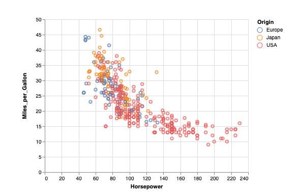
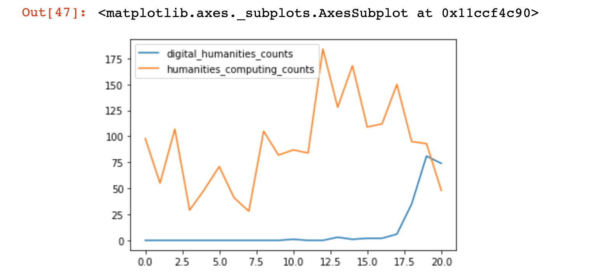
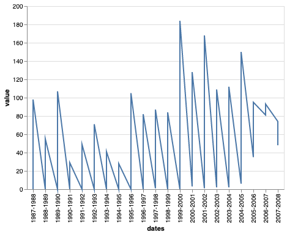
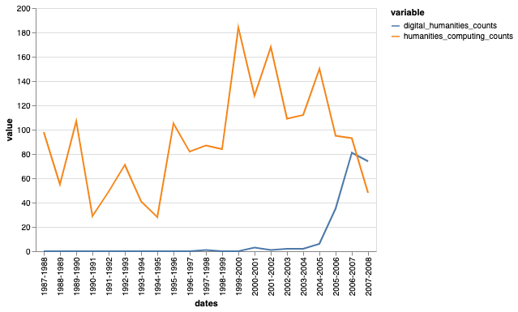
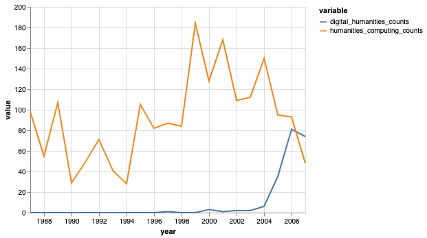

# Data Visualization in Python and Pandas

Up to now we've been using Pandas built in `plot` methods to display our data. While this is helpful for quick analyses, you'll likely want more options for both how you visualize the data and interact with it.

In Python, there are a number of visualization libraries, including Matplotlib, Seaborn, and Plotly that have extensive communities and documentation. Today we're going to focus on [Altair](https://altair-viz.github.io/index.html), which is a Python library built on top of Vega and Vega-Lite - two visualization libraries for JavaScript.

### Introduction to Altair

*Let's install Altair*

```sh
pipenv install altair vega vega_datasets
```

*Now let's try it out in our Jupyter Notebook*

```python
import altair as alt
```
Because we are using Altair in a Jupyter Notebook we also need to add a few settings (you read more about this here [https://altair-viz.github.io/user_guide/display_frontends.html#displaying-in-the-jupyter-notebook](https://altair-viz.github.io/user_guide/display_frontends.html#displaying-in-the-jupyter-notebook))

```python
alt.renderers.enable('notebook')
alt.data_transformers.enable('default', max_rows=None)
```

Now we can try out Altair with one of the built-in datasets

```python
cars = alt.load_dataset('cars')
alt.Chart(cars).mark_point().encode(
    x='Horsepower',
    y='Miles_per_Gallon',
    color='Origin',
)
```
You should now see the following graph:



If you don't see the graph, you might need to set the kernel of your notebook [https://stackoverflow.com/questions/47295871/is-there-a-way-to-use-pipenv-with-jupyter-notebook](https://stackoverflow.com/questions/47295871/is-there-a-way-to-use-pipenv-with-jupyter-notebook) or set the vega extension with following:

```sh
jupyter nbextension install --sys-prefix --py vega
```
*So let's breakdown what we're doing here*

First we are specifying a new `Chart` class and then specifying the type of `mark` we are using. In Altair, we can use all types of marks to represent our data [https://altair-viz.github.io/user_guide/marks.html](https://altair-viz.github.io/user_guide/marks.html). Finally we are calling encoding to specify what variable we want to represent on the `x` and `y` axis, as well as through the `color` encoding. Altair has many fields for encoding [https://altair-viz.github.io/user_guide/encoding.html](https://altair-viz.github.io/user_guide/encoding.html)

---
*So let's try recreating our graph charting the frequency of Humanities Computing versus Digital Humanities in our scraped dataset*


```python
humanist_vols['humanities_computing_counts'] = humanist_vols.text.apply(lambda x: x.count('humanities computing'))
humanist_vols['digital_humanities_counts'] = humanist_vols.text.apply(lambda x: x.count('digital humanities'))
counts = humanist_vols[['digital_humanities_counts', 'humanities_computing_counts']]
counts.plot()
```



*What are some of the problems with this graph?*

Let's try rebuilding it in Altair, what we want to represent on our `x` and `y` axis?

Almost immediately you'll realize that we need to reshape our data to be able to show both counts.

In data analysis, you will often need to transform your dataset from `wide to long` and `long to wide` (that is adding more rows vs more columns). Pandas has a number of ways to do that, and you can read more about it here [https://pandas.pydata.org/docs/user_guide/reshaping.html#reshaping-by-melt](https://pandas.pydata.org/docs/user_guide/reshaping.html#reshaping-by-melt).

Today we're going to try melting our dataset to turn our `digital_humanities_counts` and `humanities_computing_counts` into rows.


So looking at the syntax, first we need to decide what our `id_vars` will be. Which raises the question of what else might we want to display in the graph? (*hint* think about time!)

```python
counts_melted = pd.melt(counts, id_vars=['dates'])
```

Now in `counts_melted` we should have columns for `dates`, `variable`, and `value`, which contains our transformed columns.

So let's try making our chart:
```python
alt.Chart(counts_melted).mark_line().encode(
    x='dates',
    y='value',
)
```
This produces the following graph:



*What do we need to add to our graph?* hint look below!



Let's try specifying the data types for Altair [https://altair-viz.github.io/user_guide/encoding.html#encoding-data-types](https://altair-viz.github.io/user_guide/encoding.html#encoding-data-types), which one would we use for each of our fields?

*What happens if we try using the temporal encoding on dates?*

One of the trickiest areas for data analysis is working with dates and times (think timezones and formatting!).

Pandas has built-in functionality to handle dates so we're going to try and add a column to our dataframe that holds the year. Take a look at the docs [https://pandas.pydata.org/pandas-docs/stable/reference/api/pandas.to_datetime.html](https://pandas.pydata.org/pandas-docs/stable/reference/api/pandas.to_datetime.html)

*How could we get the year for each of our rows?*

```python
counts['year'] = counts.dates.str.split('-').str[0]
counts['year'] = pd.to_datetime(counts.year, format='%Y', errors='ignore')
```
Now let's try rerunning our graph but using `year`.



Woot! We officially have recreated this graph and added more information that would be useful to a reader.

With Altair, we can also add interactivity! Let's try adding a tooltip that displays both values at once when hovered.

Check out this example [https://altair-viz.github.io/gallery/scatter_tooltips.html](https://altair-viz.github.io/gallery/scatter_tooltips.html)

We can also create multiple charts in one plot. How else could we display our data?

Finally we can save our charts using a few different mechanisms, read more here [https://altair-viz.github.io/user_guide/saving_charts.html](https://altair-viz.github.io/user_guide/saving_charts.html)
