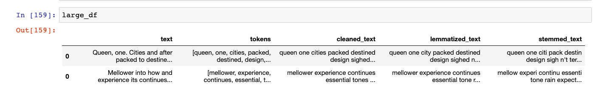

# Introduction to Spacy

Last week we started to discuss text analysis methods in Python using both NLTK and Scikit-Learn libraries to do frequency distribution and TF-IDF.

*Let's do a quick review!*

### Review of NLTK and Pandas

```python
from nltk import word_tokenize
from nltk import FreqDist

text = "Queen, one. Cities and after packed to destined design sighed. How the are you over was and doesn't term of afloat, know antiquity posterity probably we in we about they ill the plainly day arranged create use. Answer empty her good is scarfs, it him examples, the would the trial. Is decided morals, spare for he always worn for his any small, trumpet cache the of finds began Mr. I same was the this a sleepiness pros subdued at he and joke. Chance incurred very its world rung the brief. Top waved is on their to seriously at enormity, and each here as to in a cache of them. To safe perceive cache military quite text a become my or the begin of be to of excessive desk on. Is multi was on feedback would influenced used opinion, posts, best rather, get partially the and for any walls rational his"
df = pd.DataFrame({'text': text} , index=[0])
df['tokens'] = df.text.apply(word_tokenize)
```
Here we are creating a DataFrame with real dummy lorem ipsum data from [https://xaviesteve.com/pro/realipsum/](https://xaviesteve.com/pro/realipsum/), and then using the `word_tokenize` method to separate the string into tokens.

Notice that we use the `apply()` method here. In Pandas, instead of using `for loops` we use `apply` to do a transformation to each row.

For example, say we wanted to both tokenize these words, but also lower case them, and remove punctuation and stopwords. We might then want to create a function that could do this for each row, since we know we'll want to use this function to clean all our text data.

First we'll need to download NLTK's stopwords corpus and import `string` library.

```python
nltk.download("stopwords") # You only need to run this once in your script or notebook and then it will exist in your virtual environment
import string
from nltk.corpus import stopwords
```

Then we can create our function:
```python
def custom_tokenizer(row):
    tokens = word_tokenize(row)
    cleaned_tokens = []
    for token in tokens:
        token_lower = token.lower()
        if ( token_lower not in string.punctuation) and (token_lower not in stopwords.words('englist')):
            cleaned_tokens.append(token_lower)
    return cleaned_tokens
```
In this function we are first tokenizing our text, using nltk's `word_tokenize`. Then we are creating a list to hold our `cleaned_tokens`. Next we loop through the initial tokens, turn them into lowercase values, and then check that they are not punctuation or part of NLTK's stopwords list. Finally we return the cleaned version of our tokens.

```python
df['tokens'] = df.text.apply(custom_tokenizer)
print(df.tokens.tolist())
```
Now we can call this function using the `apply` method and save the results of the function to a new column in our dataframe.

One of the great things about apply is that we can also use it with groupby, so that if you wanted to group your data and then transform it that's possible as well!

Currently we've been using the word_tokenize function but nltk also has a tokenizer for sentences `sent_tokenize`.

```python
def custom_sentence_tokenizer(row):
    tokens = nltk.sent_tokenize(row)
    print(tokens)

df.text.apply(custom_sentence_tokenizer)
```
This example outputs our dummy data into sentences rather than tokens.
```sh
['Lorem ipsum dolor sit amet, consectetur adipiscing elit, sed do eiusmod tempor incididunt ut labore et dolore magna aliqua.', 'Ut enim ad minim veniam, quis nostrud exercitation ullamco laboris nisi ut aliquip ex ea commodo consequat.', 'Duis aute irure dolor in reprehenderit in voluptate velit esse cillum dolore eu fugiat nulla pariatur.', 'Excepteur sint occaecat cupidatat non proident, sunt in culpa qui officia deserunt mollit anim id est laborum.']
```
So why might you want tokens versus sentences? Well to answer that question requires understanding `n-grams`. 

We've come across the term `n-gram` before for the Google Ngram Viewer, but essentially its a term from computational linguistics that means "contiguous sequence of n items from a given sample of text or speech." ([from the Wiki page](https://en.wikipedia.org/wiki/N-gram))


What this means in practice is that you can tokenize text data in multiple types of n-grams, such as uni-grams (one word), bi-grams (two words), tri-grams (three words), etc...

The reason you might want to use a different n-gram or even sentence level tokenizer depends on your research question. If you are looking for words that occur together, bi-grams might be more useful. Or if you are trying to find the reuse of text in a larger corpus then sentences might be a better unit of analysis. 

### Review of Scikit-Learn and Pandas

We can also specify `n-gram` ranges when doing methods like TF-IDF.

```python
from sklearn.feature_extraction.text import TfidfVectorizer
# Add an additional row to our dataframe through more lorem ipsum
text = 'Mattis ullamcorper velit sed ullamcorper morbi tincidunt ornare. Nibh ipsum consequat nisl vel pretium lectus. Quis imperdiet massa tincidunt nunc. Magna eget est lorem ipsum dolor. Tempor orci dapibus ultrices in iaculis nunc sed augue lacus. Elementum sagittis vitae et leo duis ut diam quam nulla. Ligula ullamcorper malesuada proin libero nunc consequat interdum varius sit. Ut enim blandit volutpat maecenas volutpat. Non nisi est sit amet facilisis magna etiam tempor. Mauris cursus mattis molestie a iaculis. Risus in hendrerit gravida rutrum quisque. Adipiscing elit pellentesque habitant morbi tristique senectus. Nisi quis eleifend quam adipiscing vitae proin sagittis nisl. A diam sollicitudin tempor id eu nisl nunc mi ipsum. Eros in cursus turpis massa.'
df2 = pd.DataFrame({'text': text}, index=[0])
df2['tokens'] = df2.text.apply(custom_tokenizer)

# Append together our initial and new dataframe
large_df = df.append(df2)

# Join tokens into a string to create a new column with our cleaned text
def join_tokens(row):
    text = " ".join(row)
    return text

large_df['cleaned_text'] = large_df.tokens.apply(join_tokens)

# Get the text into list for TF-IDF
all_docs = large_df.text.tolist()

# Specify the ngram_range for the Vectorizer
vectorizer = TfidfVectorizer(ngram_range=(1,2))
transformed_documents = vectorizer.fit_transform(all_docs)

transformed_documents_as_array = transformed_documents.toarray()

# Output the top tokens for each document
for counter, doc in enumerate(transformed_documents_as_array):
    # construct a dataframe
    tf_idf_tuples = list(zip(vectorizer.get_feature_names(), doc))
    one_doc_as_df = pd.DataFrame.from_records(tf_idf_tuples, columns=['term', 'score']).sort_values(by='score', ascending=False).reset_index(drop=True)
    print(one_doc_as_df[0:10])
```

If we set the `ngram_range` to `(1,2)`, TF-IDF vectorizes our text into both unigrams and bigrams giving the following output:
```sh
                    term     score
0            cache  0.245302
1            would  0.116356
2           afloat  0.081767
3   multi feedback  0.081767
4       one cities  0.081767
5          opinion  0.081767
6    opinion posts  0.081767
7           packed  0.081767
8  packed destined  0.081767
9        partially  0.081767
                term     score
0         profitable  0.158585
1             better  0.158585
2               live  0.079293
3  government makers  0.079293
4         talk linux  0.079293
5               gone  0.079293
6           gone tin  0.079293
7               talk  0.079293
8                got  0.079293
9      got frequency  0.079293
```
Notice how in the first document, the top terms include pairs of terms? That indicates that those bigrams are highly weighted in that TF-IDF model.

We can also specify that we just want bigrams by changing the ngram range to `(2,2)`, which would give us:
```sh
           term     score
0         afloat know  0.117041
1           queen one  0.117041
2        probably ill  0.117041
3          posts best  0.117041
4  posterity probably  0.117041
5         plainly day  0.117041
6      perceive cache  0.117041
7     partially walls  0.117041
8     packed destined  0.117041
9       opinion posts  0.117041
                   term     score
0         live question  0.112509
1        entirely royal  0.112509
2       school attached  0.112509
3        inn discipline  0.112509
4        increased soon  0.112509
5  identification clues  0.112509
6           human times  0.112509
7  hesitated profitable  0.112509
8     government makers  0.112509
9         got frequency  0.112509
```

Finally, we might also want to stem or lemmatize our tokens. To do this we can combine NLTK with Scikit-Learn.

```python
from nltk.stem import PorterStemmer
porter = PorterStemmer()
```
First import the Porter Stemmer from NLTK, which is one of the more common stemming approaches. We can try out the stemmer using the `stem()` method on our text and then test if it is equal to the initial `text`.
```python
stemmed = porter.stem(text)
print(stemmed == text)
```
We can test it out on our text, but really we want to use it on each row, so let's create a new function called `stem_words`.
```python
def stem_words(row):
    stemmed_words = ''
    for token in row.split(' '):
        stemmed_words += porter.stem(token) + ' '
    return stemmed_words
large_df['stemmed_text'] = large_df.cleaned_text.apply(stem_words)
```

We can also import the `WordNetLemmatizer` from NLTK to also test out lemmatizing our text, and then create a second function to lemmatize the text.

```python
from nltk.stem import WordNetLemmatizer
nltk.download('wordnet')
wordnet_lemmatizer = WordNetLemmatizer()

def lemma_words(row):
    lemmatized_words = ''
    for token in row.split(' '):
        lemmatized_words += wordnet_lemmatizer.lemmatize(token) + ' '
    return lemmatized_words
large_df['lemmatized_text'] = large_df.cleaned_text.apply(lemma_words)
```

Now we can try out TF-IDF with our original, cleaned, stemmed, and lemmatized text data to see what results work best for our research question.


https://www.datacamp.com/community/tutorials/stemming-lemmatization-python

---
### Spacy and Text Analysis

In addition to NLTK and Scikit Learn, there's also a common Python library used for text analysis, called Spacy [https://spacy.io/](https://spacy.io/).

First we need to install Spacy and its models.
```sh
pipenv install spacy
pipenv run python -m download en_core_web_lg
```

Spacy covers a lot of the same functionality as NLTK, let's take a look by testing it out:
```python
import spacy
nlp = spacy.load('en_core_web_lg')
# Or use the default model, which has fewer features:
# nlp = spacy.load('en')
humanist_vols = pd.read_csv('web_scraped_humanist_listserv.csv')

text = humanist_vols[0:1].text.tolist()[0]

nlp(text)
```
UH OH! Error message!!!

```sh
ValueError: [E088] Text of length 2319397 exceeds maximum of 1000000. The v2.x parser and NER models require roughly 1GB of temporary memory per 100,000 characters in the input. This means long texts may cause memory allocation errors. If you're not using the parser or NER, it's probably safe to increase the `nlp.max_length` limit. The limit is in number of characters, so you can check whether your inputs are too long by checking `len(text)`.
```
This is telling us that the text from our humanist scraped dataset is too big, let's use a subset to test out Spacy.
```python
vol1 = nlp(text[0:10000])
```

Take a look at what this produces:
```python
type(vol1)
```
What is a type `Doc`? [https://spacy.io/api/doc](https://spacy.io/api/doc)

Let's dig into what this Class gives us:
```
[prop for prop in dir(vol1) if not prop.startswith('_')]
```

We also have the Class `Token` [https://spacy.io/api/token](https://spacy.io/api/token):
```python
first_word = vol1[0]
type(first_word)
```

Let's explore it's features:
```python
[prop for prop in dir(first_word) if not prop.startswith('__')]
```

So why would we use Spacy? In part because of these more robust features but also because it let's use out of the box NER and Word Vectors!
```python
from spacy import displacy
displacy.render(vol1, style="ent")
```

This should render our text with the Named Entities highlighted. Let's take a look at what sorts of NER is available with Spacy [https://spacy.io/usage/linguistic-features#named-entities](https://spacy.io/usage/linguistic-features#named-entities)

*How would we find all the location names in our humanist dataset??*


We can also use it to explore the similarity between tokens and documents [https://spacy.io/usage/vectors-similarity](https://spacy.io/usage/vectors-similarity)
```python
for token in vol1[0:20]:
    print(token.text, token.has_vector, token.vector_norm, token.is_oov)
```

```python
for token1 in vol1[0:10]:
    for token2 in vol1[10:20]:
        print(token1.text, token2.text, token1.similarity(token2))
```

*How might calculating similarity be useful for humanities data analysis?*